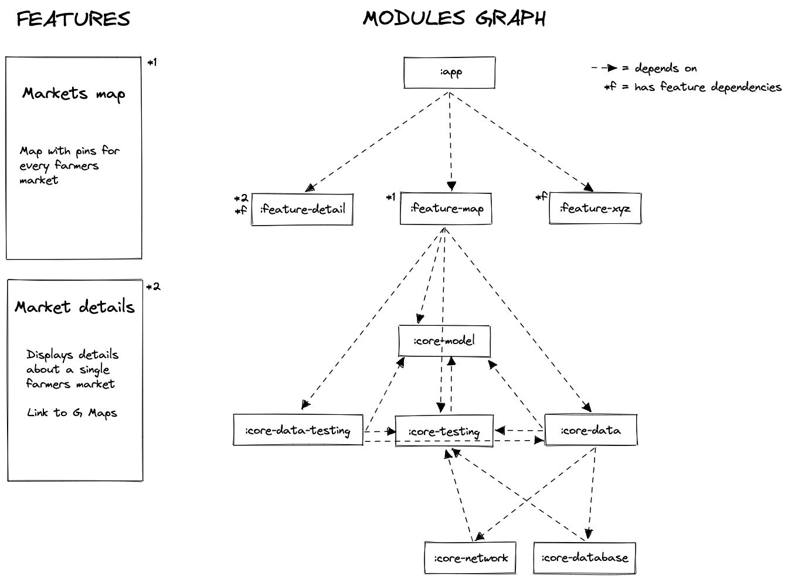

# NYC Farmers Markets

Shows the farmers markets in New York City on a map, with additional details about a market. This
is a simple app developed for fun to give a try to Jetpack Compose and the latest Jetpack libraries.

The source of the data is [NYC Open Data - DOHMH Farmers Markets](https://data.cityofnewyork.us/dataset/DOHMH-Farmers-Markets/8vwk-6iz2).

## How it is built

* Architecture pattern: MVVM + Unidirectional Data Flow
* UI layer: [Jetpack Compose](https://developer.android.com/jetpack/compose)
* Dependency injection: [Hilt](https://dagger.dev/hilt/)
* Networking: [OkHttp](https://square.github.io/okhttp/), [Retrofit](https://square.github.io/retrofit/),
  [Kotlin Serialization](https://kotlinlang.org/docs/serialization.html)
* Local database: [Room](https://developer.android.com/training/data-storage/room)
* App layers communicate via streams implemented with [Kotlin Flows](https://developer.android.com/kotlin/flow)

## Dependencies management

Dependencies are organized with Gradle Version Catalogs in `libs.versions.toml`.

## Convention plugins

The `build-logic` module defines project-wide configuration applicable to every other module.

These plugins are used to share logic between gradle files:

- `nycfarmersmarkets.android.application`, `nycfarmersmarkets.android.application.compose`
- `nycfarmersmarkets.android.library`, `nycfarmersmarkets.android.library.compose`
- `nycfarmersmarkets.android.feature`

## API keys

The app makes use of the Google Maps SDK, the Maps API key is stored in the entry `MAPS_API_KEY`
in the file `secrets.properties`.

## Modularization

There are two main types of modules:

- `core-*` modules contain common functionalities reusable by other modules, they can depend on other
  `core-*` modules
- `feature-*` modules contain the main functionalities of the app, they can depend on `core-*` modules
  and should not depend on other `feature-*` modules

The `app` module is the main module that connects all the other modules, it should depend on all the
`feature-*` modules and can depend on `core-*` modules.

### Models

The `core-models` module contains app-level domain models that make sense to be shared across many
modules.

Specific layer models live in the module they belong to. For example, network models live in the
`core-network` module, database entities live in the `core-database` module, and should not be
used by other modules depending on them.

### Data

The `core-data` module contains repositories to access application data from features.

### Features

The module `feature-map` displays all the farmers markets on a map. The user is provided with
basic controls to zoom in/out and to refresh.

The module `feature-detail` displays further details about one market selected from the map.
From here, the user can go to Google Maps with a pin where the market is located.
